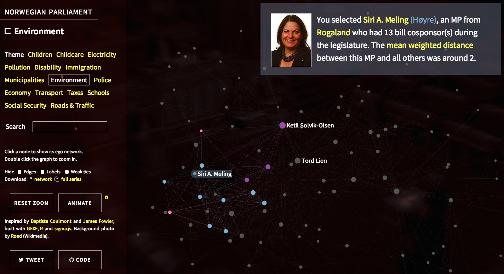

A scraper for Norwegian private bills that builds their [cosponsorship network](http://jhfowler.ucsd.edu/cosponsorship.htm). Get the legislation network by running `stortinget.r` in R until you get enough data and sponsors scraped. More data are available through the Stortinget's [open data portal](http://data.stortinget.no/).

See the [interactive demo][demo]:

[][demo]

[demo]: http://briatte.org/stortinget
